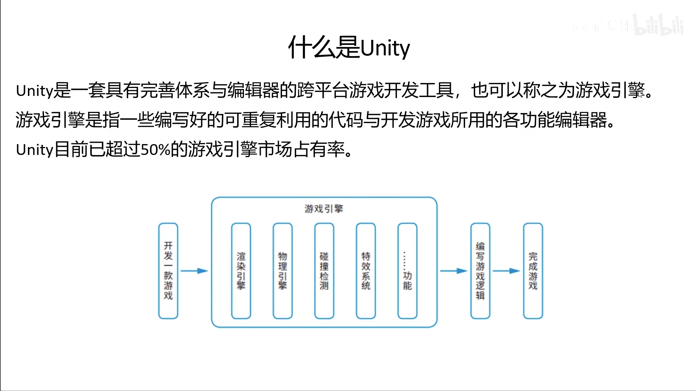

# Game Dev Learning Note
## 课程
### 音频内容

来源：[IT萌新休闲屋](https://www.ximalaya.com/album/56011370)
2. 游戏开发：如何学习一门编程语言
3. 游戏开发：如何正确学习Unity游戏开发
14. 想做游戏赚钱?了解下游戏编辑器

游戏引擎较游戏编辑器（地图编辑器）更为底层，涉及更多的代码，并且起步较难，但是可以使用游戏引擎开发游戏编辑器。

---

### 视频教程
来源：[【Unity教程】零基础带你从小白到超神](https://www.bilibili.com/video/BV1gQ4y1e7SS/?spm_id_from=333.337.search-card.all.click&vd_source=1326701cdf7380d3c938fb714146575a)

#### [01.游戏引擎是啥玩意？](https://www.bilibili.com/video/BV1gQ4y1e7SS?p=2)
+ 什么是Unity

应和市场，最多人使用的游戏引擎。

1. 重复利用代码。
2. 开发游戏的功能的编辑器。

Unity 优点
1. C#， 
2. 面向组件，
3. what you see is what you got, 
4. econ-system，商城里面有现成东西
5. multi-platform

#### [02.Unity，清说出你的优势](https://www.bilibili.com/video/BV1gQ4y1e7SS?p=3)
1. AR, VR, MR 技术等等可以满足跨平台。
2. 游戏例子：永恒之柱，空洞骑士，糖豆人，炉石传说，原神，王者，lol手游。

#### [03.动起来，下载与安装](https://www.bilibili.com/video/BV1gQ4y1e7SS?p=4)
LTS：长期稳定版本，项目首选。

Useful setting:
Edit $\Rightarrow$ Preferences
Edit $\Rightarrow$ Project Settings

Console:
Window $\Rightarrow$ General $\Rightarrow$ Console
